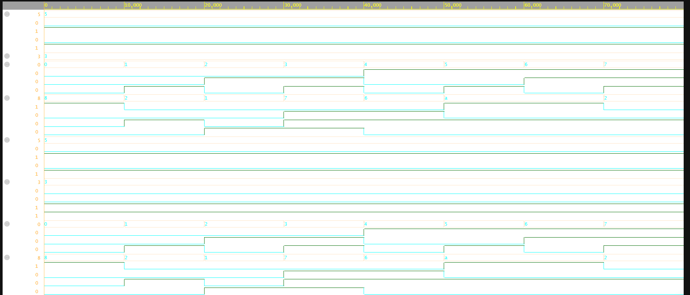

# 🔢 4-bit ALU in Verilog

This project implements a 4-bit Arithmetic Logic Unit (ALU) using Verilog.  
It supports basic arithmetic and logical operations and is tested using a simple testbench and waveform visualization.

---

## ⚙️ ALU Operations

| Opcode (`op`) | Operation     | Description              |
|---------------|---------------|--------------------------|
| `000`         | A + B         | Addition                 |
| `001`         | A - B         | Subtraction              |
| `010`         | A & B         | Bitwise AND              |
| `011`         | A \| B        | Bitwise OR               |
| `100`         | A ^ B         | Bitwise XOR              |
| `101`         | ~A            | Bitwise NOT (on A only)  |
| `110`         | A << 1        | Left Shift               |
| `111`         | A >> 1        | Right Shift              |

---

## 📂 Files Included

| File              | Description                                 |
|-------------------|---------------------------------------------|
| `alu.v`           | ALU module code                             |
| `testbench.v`     | Testbench that applies all opcodes          |
| `waveform.png.png`| ✅ Screenshot showing waveform (rename if needed) |
| `desktop.ini`     | 🔸 Windows system file (can ignore/delete)   |

---

## 🖥️ Simulation Environment

### ✅ Inputs:
- `A = 4'b0101` (decimal 5)
- `B = 4'b0011` (decimal 3)

### 🔁 Testbench cycles through all opcodes (from `000` to `111`)

### 🧪 Output:
- Output `Y` changes according to `op` value

---

## 📊 Waveform Screenshot

> ALU output (`Y`) changes for each opcode while `A` and `B` remain fixed.

---

## 💡 Tools Used

- **Icarus Verilog** for simulation (`iverilog`, `vvp`)
- **GTKWave** for waveform visualization
- **EDA Playground** for quick online testing

---

## 📘 What I Learned

- How to write combinational logic in Verilog
- Structuring a testbench for multiple opcodes
- Simulating hardware behavior using waveform analysis
- Mapping logic operations to binary control signals

---

> 🚀 Feel free to fork this repo and build on top of it (e.g., add Carry/Zero flags, pipelining, or UART I/O).

